# **Portfolio - Web Technologies.**

## GitHub Repo
  ### *[repo](https://github.com/Juanmasoa/juanmasoa.github.io)*
  ### *[portfolio website](https://juanmasoa.github.io)*

## Description of the portolio website
The aim of this project is create a portfolio with HTML and CSS web technologies in a way that it shows it´s designer´s personality (so thay potential employers know if he fits whit their company culture) and professional/academic background.

### Features
- Each page (separately):
1. Home page from which user can access the other 4 pages. There are 4 bottoms, each of which sends the user to the correspondent page.
.png)
.png)
2. Juanma page: a brief story about the developer and it´s main personal characteristics. It contains two images in its html file and two background images.
.png)
.png)
3. CV/Background page: Very schematic summary of creator´s CV. There are 4 sections: Academic (excellence scholarships, dual degree and coding), Professional (paid positions), Volunteer and Own Projects (ones started by the developer: a start-up and a poetry group). It also has an animation which tries to transmit the effort in the pursuit of knowledge and expertise.
.png)
.png)
4. Art page: art deserves a special mention in the developer´s life. It contains some links to the previous and current blogs, two fixed background images, and one html image.
.png)
.png)
5. Contact page: a first "my details" section with LinkedIn´s badge and GitHub logo, the latter being an html image, linked to the online repository.
.png)
.png)

- Common features:
1. (Except for the Home page) A home button to go back to Home page.
2. Footers:
⋅⋅1. License footer: to indicate the webpage is under a NonCommercial Creative Commons license.
⋅⋅2. Contacy footer: with developer´s email, and GitHub and LinkedIn profiles.

### Sitemap
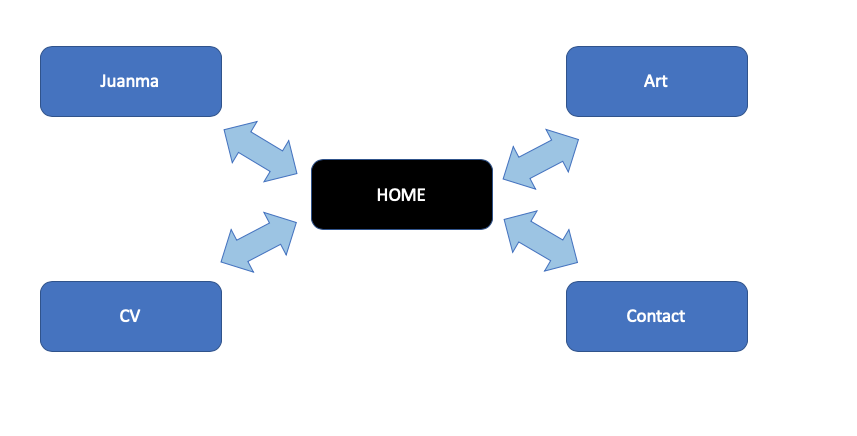

### Target audience
Potential employers and future Coding students. 

### Tech stack
HTML and CSS. The LinkedIn badge is code in Js. 

## Description of the design, development process
### Design process
I followed a kind-of **agile methodology** being myself both the client and the development. I chose that because this is the first complete site I developed, and I wanted to wireframe the page while I was coding it. This allowed me to change quickly if something wasn´t working because I didn´t spend one whole day or so just in wireframing tasks, so I could start coding earlier.

Furthermore, I started coding the HOME page for mobile soon in order to be trained and aware of how much time each type of function would take me to implement.

### Wireframes
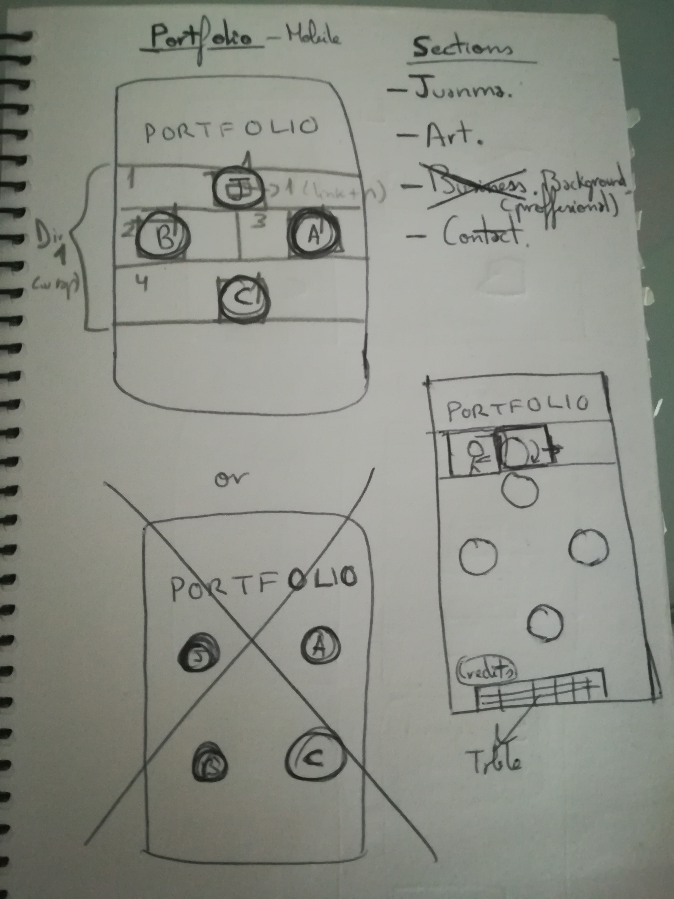
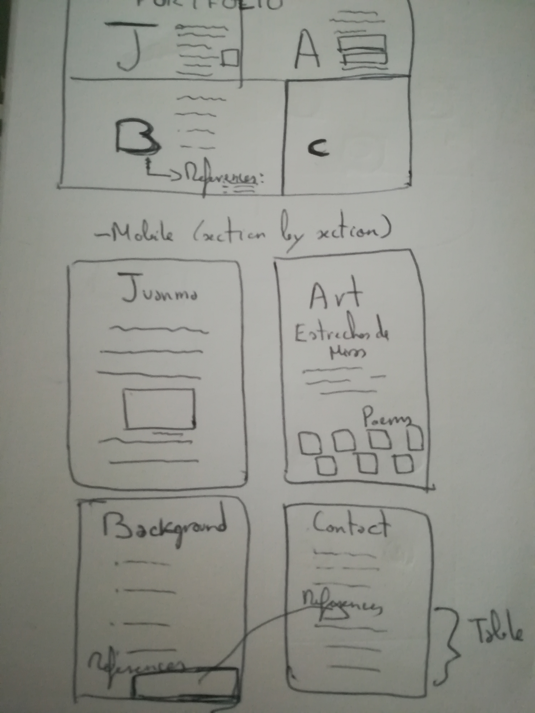
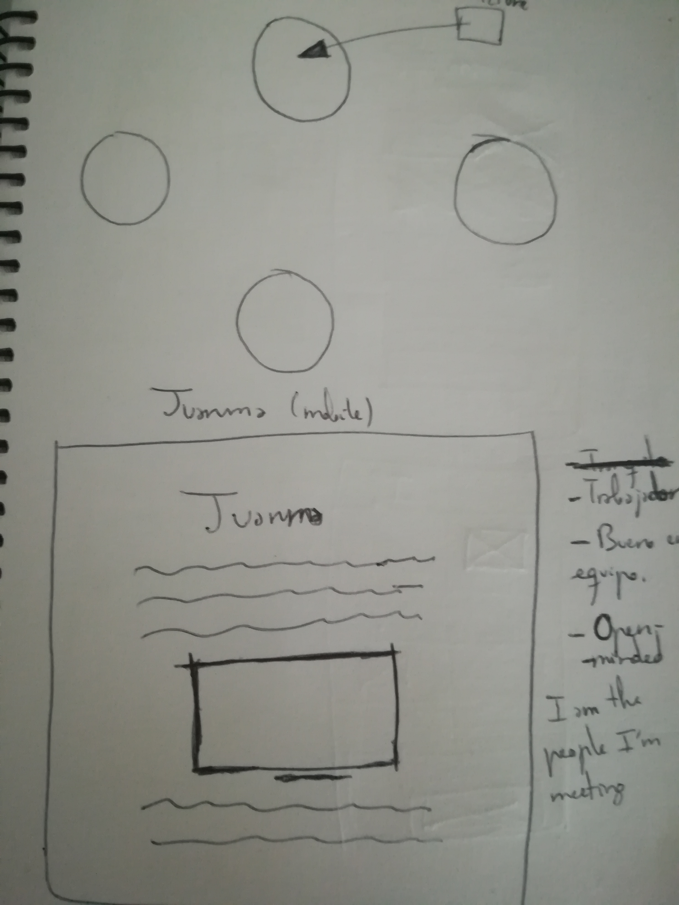
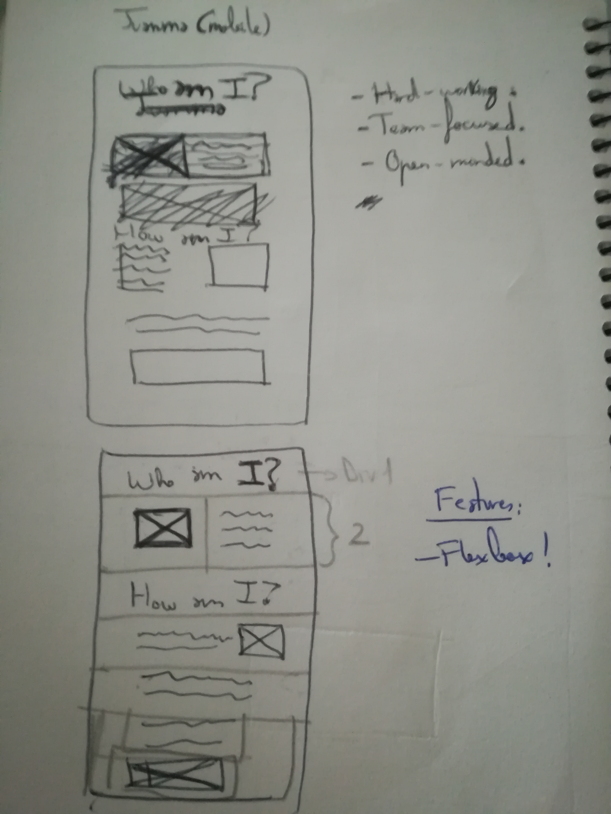
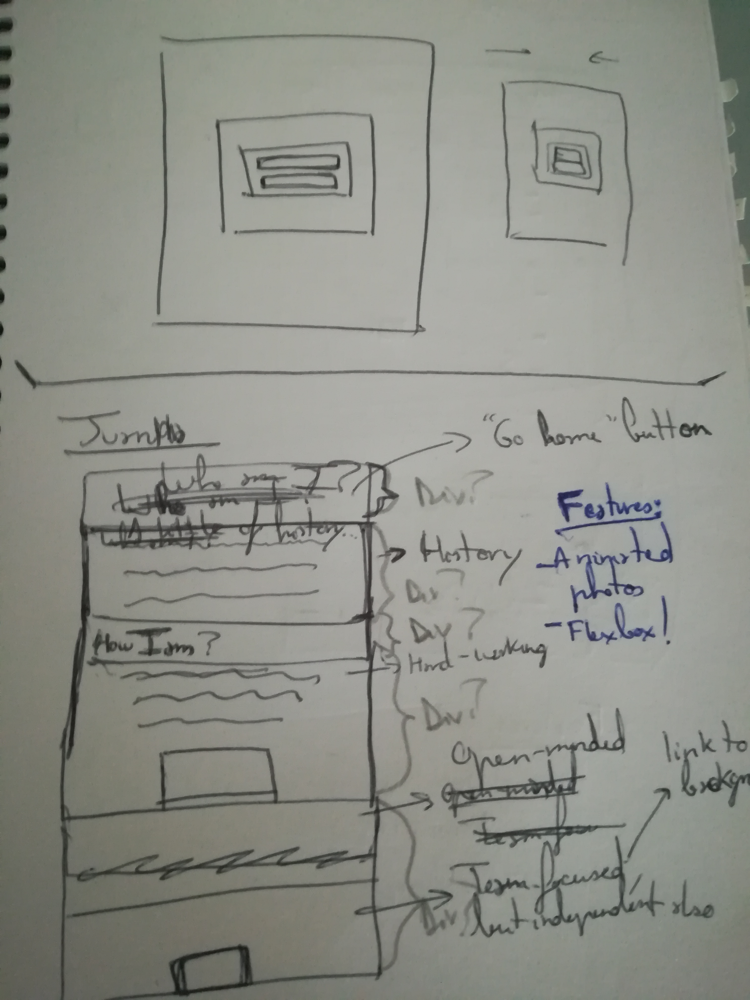
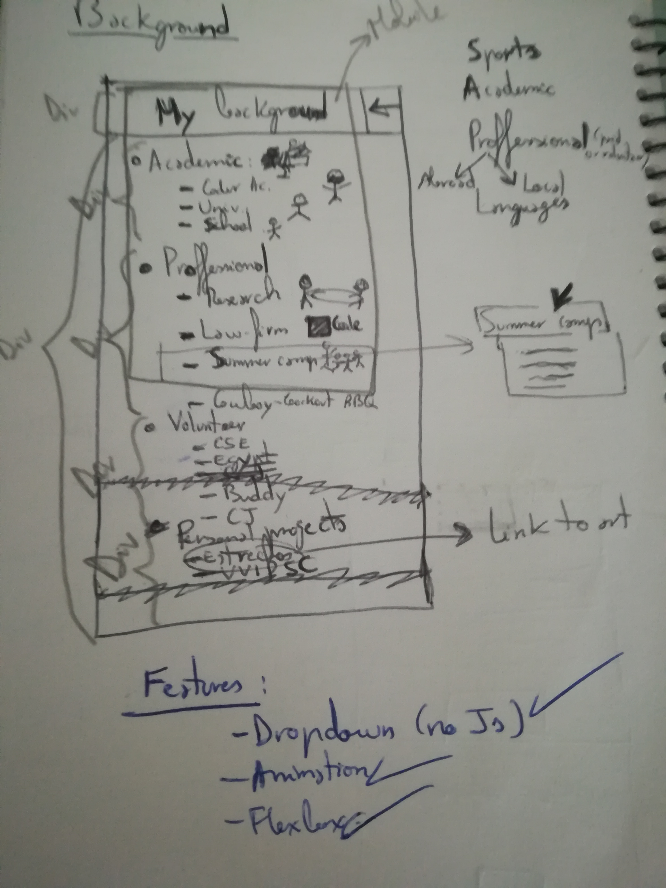
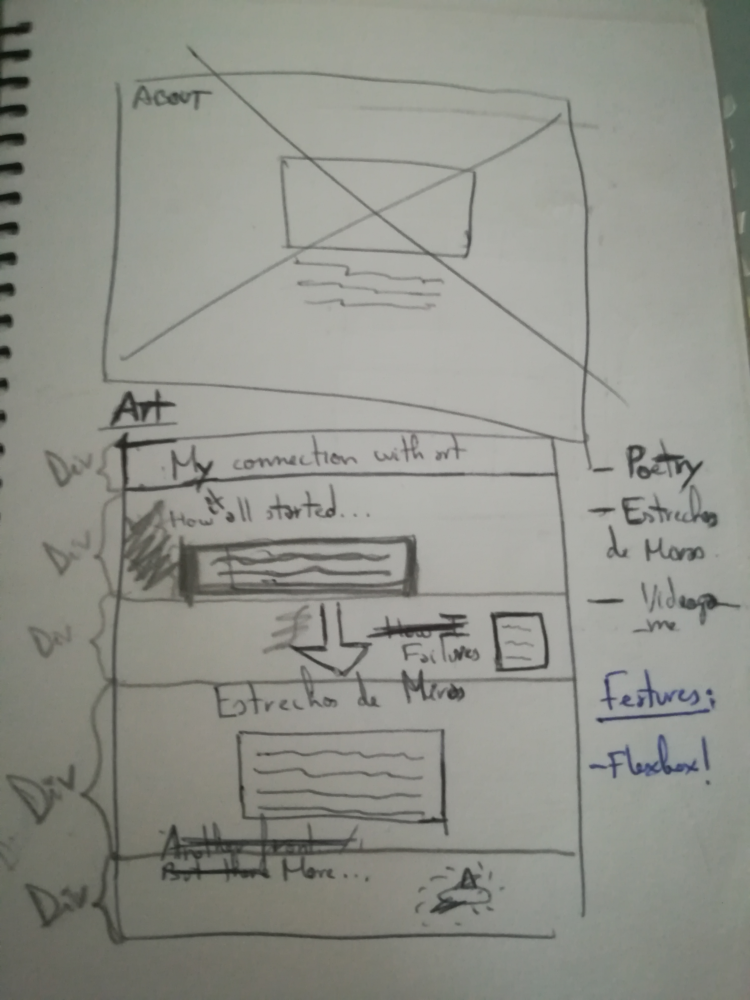
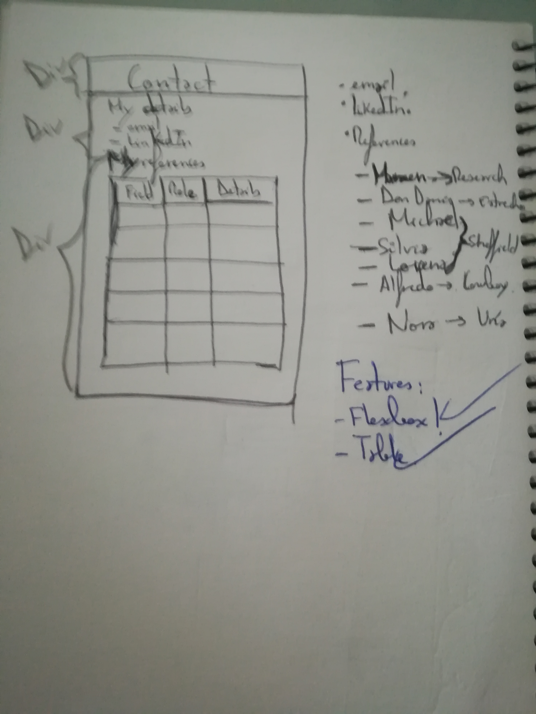
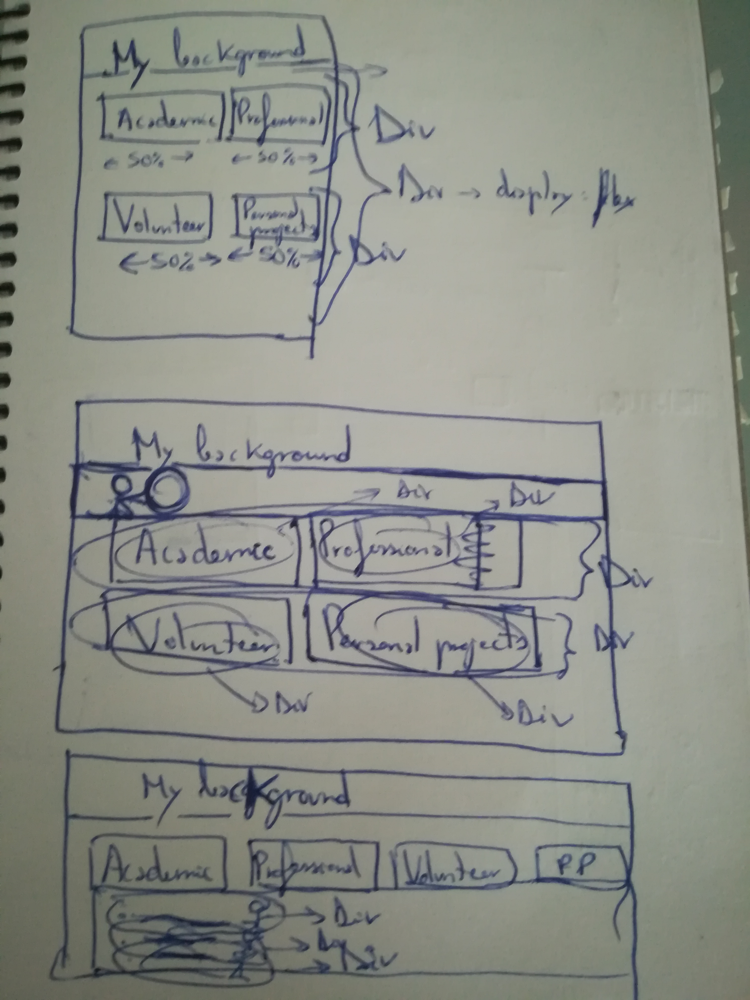

As you can see, pencil was used to divide each page on divs so it was easy to implement it in the coding tools. Youc an also find the needed features indicated in blue in some of the wireframes.

### Usability considerations
In order to make the page responsive, I used media queries. For the mobile part of HOME page, I used button tags in order to make the page user-friendly and intuitive. 

#### Accessibility concerns
I tried to avoid the use of br tags and instead applied **div tags and flex-box**. Similarly, words were made **strong** and were **emphasized** when necessary rather than using bold and italic options.

Moreover, **roles** were specified in the only table built for this project (in contact page, reference section).

Also, *lang=en* was specified in every html file, and **alt attribute** was used for html images. 

To finish with, **meta tags** were used to describe each page´s content.

### Planning process
Firstly, I design a draft of my schedule to state the big parts of the process (wireframing, function coding, style, documentation, submission).
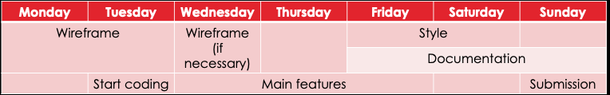
To set my steps, I used platform Trello, which is really convenient and user-friendly.
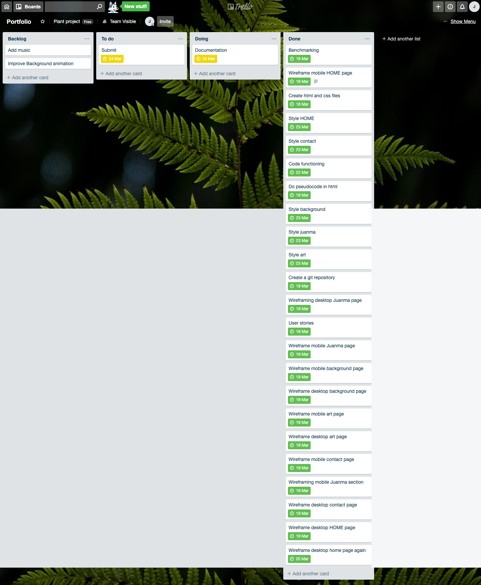

## The History of Internet
### Key events in the development of the internet from the 1980s to today
-	In 1983 Defense of USA uses the TCP / IP protocol in its Arpanet network.
-	1989: Tim Berners Lee describes the protocol of hypertext transfers that would lead to the first web using three new resources: HTML, HTTP and Web Browser. 
-	1990: the Internet is born in a closed form within CERN.
-	1991: external users to CERN begin to access this information.
-	1993: Mosaic web browser is created. It is the first to show images in line with text, as other graphical user interface norms (eg.: browser’s URL address bar and back/forward/reload options for viewing webpages.)
-	1995: the NSFNET is decommissioned.
-	1996: Internet2 project is initiated by 34 universities, Service Providers begin appearing such as Sprint and MCI and Nokia releases first cell phone with internet access.
-	1999: 802.11b, a wireless technology, referred to as Wi-Fi, is standardized.
-	2005: Youtube launches.

Sources: 
 - [A Brief Guide to the History of the Internet](https://www.investintech.com/resources/articles/historyinternet/)
 - [Historia de Internet: cómo nació y cuál fue su evolución](https://marketing4ecommerce.net/historia-de-internet/)

### Relationship between fundamental aspects of the internet such as: domains, web servers, DNS, and web browsers
1.	User types a web address into the browser.
2.	Browser goes to a special server called DNS, which matchs up that web address typed into the browser (the domain) to the website's real IP address.
3.	The browser sends an HTTP request message to the server, asking it to send a copy of the website to the client. This message, and all other data sent between the client and the server, is sent across your internet connection using TCP/IP.
4.	If the server approves the client's request, the server sends the client a "200 OK" message, and then starts sending the website's files to the browser as a series of small chunks called data packets (this división is necessary to make the web available for more than one user at a time).
5.	The browser assembles the small chunks into a complete website and displays it to you.

Sources
- [How the Web works](https://developer.mozilla.org/en-US/docs/Learn/Getting_started_with_the_web/How_the_Web_works)

### One aspect of the development of internet technologies and how it has contributed to the world today.
The internet has reinvented **communication**. The continuous advances have led to the appearance of numerous methods of electronic communication, eg.: social networking websites, emails, voicemails, and video conferences. 

These advanced communication tech tools have helped us to eliminate time and distance as obstacles to effective communication. This is beneficial to our personal relationships, to education and to business. Technology has improved cultural education by giving students the opportunity to communicate with others overseas.

Three fields in which communication improvement is straightforward are:
1. Expression/Consumption of expertise : news came from a limited number of sources and at few times. Now there are unlimited sources (cable news networks, blogs, newsfeeds, tweets…, pique 24/7.
2. Finding a partner: Tinder has (sadly) substituted bars.
3. Keeping in touch: letters have been replaced by Social Media, online messaging services…

It´s necessary to find a balance between the cyber world and real world.

Sources: 
- [The 6 Main Ways Technology Impacts Your Daily Life](https://tech.co/news/6-main-ways-technology-impacts-daily-life-2017-02)

## Credits:
- All the cartoon-style pictures were taken from [Noun Project](https://thenounproject.com)
1. Snow-ball: Maxicons
2. Home: Saifurrijal
3. Motivation: Eucalyp.
4. Mum and son: Gan Khoon Lay.
- The event picture in art page exists thanks to [Javicas_Photo](https://www.flickr.com/photos/149322302@N07/)
